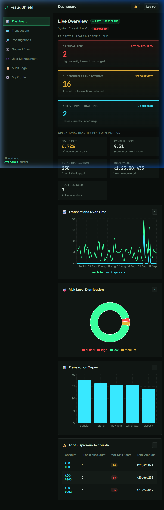
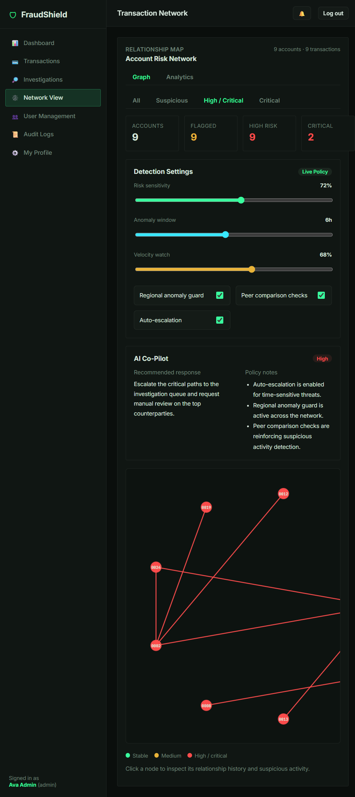
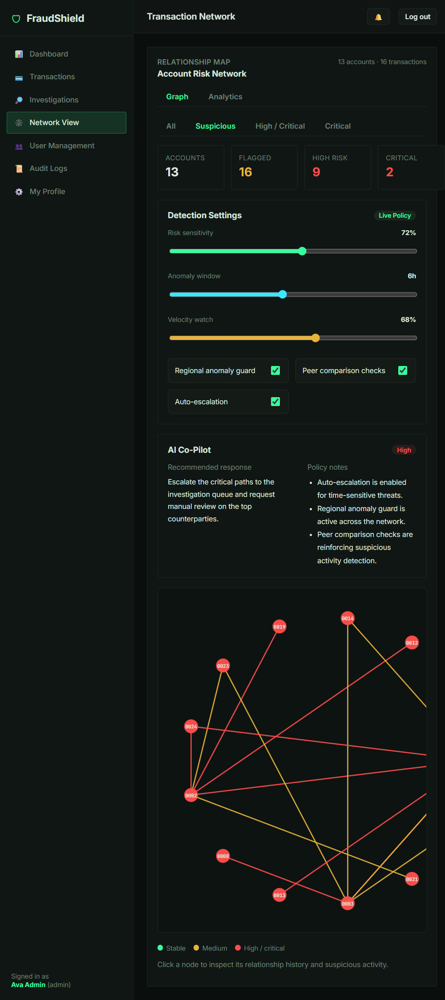
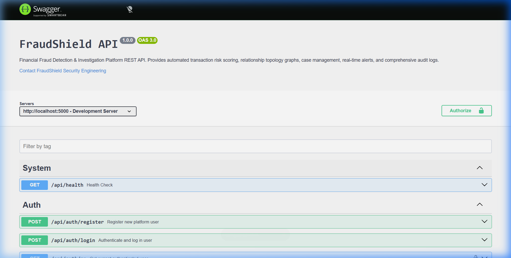

# 🛡 FraudShield — Financial Fraud Detection & Investigation Platform

[](https://fraud-shield-sand.vercel.app)
[](https://fraudshield-api-7an9.onrender.com/api/docs)
[](https://github.com/dheerajkmahale/FraudShield)
[](LICENSE)

FraudShield is a full-stack financial fraud detection and investigation platform designed to monitor transactions in real time, identify suspicious velocity and structuring patterns, manage investigative cases with linked evidence, and provide security-focused operational visibility.

---

## 🌐 Live Deployments

| Component | URL | Status | Description |
|---|---|---|---|
| **Web Application** | [https://fraud-shield-sand.vercel.app](https://fraud-shield-sand.vercel.app) | `Active` | Production React SPA hosted on Vercel |
| **REST API Server** | [https://fraudshield-api-7an9.onrender.com](https://fraudshield-api-7an9.onrender.com) | `Active` | Express + Mongoose API hosted on Render |
| **Swagger UI Docs** | [https://fraudshield-api-7an9.onrender.com/api/docs](https://fraudshield-api-7an9.onrender.com/api/docs) | `Active` | Interactive OpenAPI 3.0 documentation |
| **System Health** | [https://fraudshield-api-7an9.onrender.com/api/health](https://fraudshield-api-7an9.onrender.com/api/health) | `Active` | Service uptime & readiness probe |

---

## 📋 Table of Contents

1. [Executive Summary & Problem Statement](#-executive-summary--problem-statement)
2. [Key Capabilities & Features](#-key-capabilities--features)
3. [System Architecture](#-system-architecture)
4. [Technology Stack](#-technology-stack)
5. [Repository Structure](#-repository-structure)
6. [Authentication & RBAC Matrix](#-authentication--rbac-matrix)
7. [Fraud Detection Engine Specification](#-fraud-detection-engine-specification)
8. [API Reference & OpenAPI Specification](#-api-reference--openapi-specification)
9. [Demo Accounts & Role Profiles](#-demo-accounts--role-profiles)
10. [Environment Variables](#-environment-variables)
11. [Local Development Setup](#-local-development-setup)
12. [Testing & Quality Assurance](#-testing--quality-assurance)
13. [Production Deployment Architecture](#-production-deployment-architecture)
14. [Security Engineering & Defense-in-Depth](#-security-engineering--defense-in-depth)
15. [Visual Walkthrough & Screenshots](#-visual-walkthrough--screenshots)
16. [Future Engineering Roadmap](#-future-engineering-roadmap)
17. [License & Author](#-license--author)

---

## 🎯 Executive Summary & Problem Statement

Financial institutions and fintech platforms process thousands of transactions per second. Manually auditing spreadsheets or relying solely on coarse thresholds leads to high false-positive rates and investigator fatigue. Complex multi-hop structuring and velocity rings often go undetected until funds have settled offshore.

**FraudShield** addresses these challenges by unifying:
1. **Automated Risk Scoring**: Real-time scoring against 7 behavioral and statistical heuristics upon transaction creation.
2. **Interactive Topology Graphs**: Circular SVG account relationship mapping to immediately highlight disbursement funnels and money-mule rings.
3. **Structured Investigation Workflows**: Collaborative case management with audit notes, status transitions, and tagged transaction evidence.
4. **Defense-in-Depth Security**: Strict role-based access control, tamper-evident audit trails, rate limiting, and scoped Content Security Policies.

---

## ⚡ Key Capabilities & Features

- **JWT Authentication & Session Resilience**: Secure password hashing with bcrypt (cost factor 12), stateless token verification, and defensive client-side storage recovery that guards against corrupted state.
- **Three-Tier Role-Based Access Control**: Strict server-side authorization separating `Admin`, `Investigator`, and `Analyst` capabilities.
- **Rule-Based Fraud Detection Engine**: Deterministic scoring engine generating risk scores (0–100) and risk classifications (`Low`, `Medium`, `High`, `Critical`).
- **Live Executive Dashboard**: Real-time metrics powered by MongoDB aggregation pipelines — total financial volume, platform fraud rate, active threat counters, and Recharts trend visualizations.
- **Transaction Monitoring & Audit Export**: Server-side filtering by account, amount, risk severity, and date range; multi-column sorting; paginated tables; and one-click CSV export.
- **Investigation Case Management**: End-to-end incident workflows including priority escalation, investigator notes, linked transaction evidence, and immutable audit logs.
- **Transaction Network Visualization**: Custom SVG relationship graph highlighting account clusters, risk color-coding, and collapsible AI Co-Pilot & Behavioral Insight drawers.
- **In-App Notification Center**: 30-second REST polling architecture delivering priority alerts for suspicious and critical financial events without WebSocket overhead.
- **Comprehensive Audit Logging**: Tamper-evident logging tracking sensitive actions (authentication, transaction mutations, role reassignments, and case updates) with actor IDs and IP addresses.
- **Interactive OpenAPI 3.0 / Swagger UI**: Built-in documentation covering all 25 platform endpoints with dark-themed branding.

---

## 🏗 System Architecture

FraudShield implements a decoupled, layered client-server architecture designed for reliability, maintainability, and clean separation of concerns:

```
┌─────────────────────────────────────────────────────────────────┐
│                       Client Layer (Vercel)                     │
│  React 18 + Vite SPA  │  Vanilla CSS Tokens  │  Recharts Engine │
│  Axios HTTP Interceptor (Bearer JWT) │ 30s Polling State Sync   │
└────────────────────────────────┬────────────────────────────────┘
                                 │ HTTPS / REST API
                                 ▼
┌─────────────────────────────────────────────────────────────────┐
│                      Server Layer (Render)                      │
│  Node.js + Express  │  Scoped Helmet CSP  │  CORS Whitelisting  │
│  express-rate-limit │ express-mongo-sanitize │ Winston Logging  │
│                                                                 │
│  ┌───────────────────────────────────────────────────────────┐  │
│  │                     Middleware Pipeline                   │  │
│  │   Route Validator (express-validator)                     │  │
│  │   JWT Auth Verification (protect)                         │  │
│  │   Role Authorization (authorize)                          │  │
│  │   Audit Logger Middleware                                 │  │
│  └─────────────────────────────┬─────────────────────────────┘  │
│                                │                                │
│  ┌─────────────────────────────▼─────────────────────────────┐  │
│  │                 Controller & Service Layer                │  │
│  │   fraudDetectionService (7 Heuristic Risk Rules)          │  │
│  │   notificationService   (Transactional & Security Alerts) │  │
│  │   Centralized Error Handling (ApiError / asyncHandler)    │  │
│  └─────────────────────────────┬─────────────────────────────┘  │
└────────────────────────────────┼────────────────────────────────┘
                                 │ Mongoose ODM / TLS
                                 ▼
┌─────────────────────────────────────────────────────────────────┐
│                     Data Layer (MongoDB Atlas)                  │
│  Collections: Users │ Transactions │ Investigations │ AuditLogs │
│  Compound Indexes: (occurredAt) │ (riskLevel, fraudStatus)       │
│  High-Performance Aggregation Pipelines ($group, $cond, $facet)  │
└─────────────────────────────────────────────────────────────────┘
```

---

## 🛠 Technology Stack

### Frontend
- **Core**: React 18.3.1, Vite 5.4.1 (ES Modules)
- **Routing**: React Router DOM 6.26.1 (HTML5 history routing with SPA rewrites)
- **HTTP Client**: Axios 1.7.4 with unified response/error interceptors
- **Data Visualization**: Recharts 2.12.7 (Responsive time-series charts, bar breakdowns)
- **Design System**: Vanilla CSS design system with custom CSS custom properties, dark-mode tokens, and glassmorphic panels

### Backend
- **Runtime**: Node.js (v18+)
- **Web Framework**: Express 4.19.2 (Layered controllers, services, and route modules)
- **Object Modeling**: Mongoose 8.5.2
- **Authentication**: JSON Web Tokens (`jsonwebtoken` 9.0.2) + `bcryptjs` 2.4.3
- **Validation**: `express-validator` 7.2.0
- **Security**: `helmet` 7.1.0 (scoped CSP), `cors` 2.8.5, `express-rate-limit` 7.4.0, `express-mongo-sanitize` 2.2.0
- **Logging**: Winston 3.13.1 + Morgan 1.10.0
- **API Documentation**: OpenAPI 3.0.0, `swagger-jsdoc` 6.3.0, `swagger-ui-express` 5.0.1

### Cloud Infrastructure & Database
- **Database**: MongoDB Atlas (Multi-tenant M0/Dedicated with compound indexes)
- **Backend Hosting**: Render (Dynamic port binding, health monitoring)
- **Frontend Hosting**: Vercel (Edge CDN, SPA fallback routing)

### Testing & Tooling
- **Backend Testing**: Jest 29.7.0, Supertest 7.0.0, `mongodb-memory-server` 9.4.0
- **Frontend Testing**: Vitest 2.0.5, React Testing Library 16.0.0, jsdom 24.1.1
- **Orchestration**: Concurrently 8.2.2, Nodemon 3.1.4

---

## 📁 Repository Structure

```
FraudShield/
├── client/                               # React + Vite Frontend
│   ├── public/                           # Static assets
│   ├── src/
│   │   ├── components/                   # Reusable UI (StatCard, Badges, Tables, Skeleton...)
│   │   ├── context/                      # AuthContext, NotificationContext, ToastContext
│   │   ├── layouts/                      # AppLayout (collapsible sidebar + topbar)
│   │   ├── pages/                        # Dashboard, Transactions, Investigations, NetworkView, Profile...
│   │   ├── services/                     # Axios instance & typed API resource modules
│   │   ├── utils/                        # Currency, date, and risk formatting helpers
│   │   └── __tests__/                    # Vitest component & routing unit tests
│   ├── vercel.json                       # Vercel SPA routing fallback configuration
│   ├── vite.config.js                    # Vite bundler configuration
│   └── package.json                      # Client dependencies & scripts
│
├── server/                               # Node.js + Express Backend
│   ├── src/
│   │   ├── config/                       # db.js (Mongoose), swagger.js (OpenAPI 3.0), constants.js
│   │   ├── controllers/                  # Resource controllers (auth, user, transaction, investigation...)
│   │   ├── middleware/                   # auth (JWT), errorHandler, validation, auditLogger
│   │   ├── models/                       # Mongoose schemas: User, Transaction, Investigation, AuditLog...
│   │   ├── routes/                       # Express routers + index.js aggregator
│   │   ├── services/                     # fraudDetectionService, notificationService
│   │   ├── utils/                        # ApiError, ApiResponse, asyncHandler, logger (Winston)
│   │   ├── validators/                   # express-validator chains per endpoint
│   │   ├── seed/                         # seed.js (deterministic test data generator)
│   │   ├── __tests__/                    # Jest + Supertest integration test suites
│   │   ├── app.js                        # Express app initialization & security middleware
│   │   └── server.js                     # HTTP server startup & graceful shutdown
│   ├── .env.example                      # Sanitized backend environment template
│   └── package.json                      # Server dependencies & scripts
│
├── docs/                                 # Documentation & media assets
│   └── screenshots/                      # Platform screenshots (dashboard, network, swagger)
├── INTERVIEW_PREP.md                     # Comprehensive technical interview guide
├── README.md                             # Production documentation & project overview
├── .gitignore                            # Hardened git ignore rules
└── package.json                          # Monorepo orchestration scripts
```

---

## 🔐 Authentication & RBAC Matrix

Authentication is stateless and powered by JSON Web Tokens. Upon login or registration, the server issues a signed JWT containing the user's MongoDB `_id` and verified `role`. The token is stored in client storage and dispatched in the `Authorization: Bearer <token>` header.

The backend strictly enforces route-level authorization via `authorize(...roles)`:

| Capability / Resource | Public | Analyst | Investigator | Admin |
|---|:---:|:---:|:---:|:---:|
| User Registration & Login | ✅ | ✅ | ✅ | ✅ |
| View Platform Dashboard & KPIs | ❌ | ✅ | ✅ | ✅ |
| Search & Filter Transactions | ❌ | ✅ | ✅ | ✅ |
| Create New Transactions (Trigger Engine) | ❌ | ✅ | ✅ | ✅ |
| Update Transaction Status / Risk Override | ❌ | ❌ | ✅ | ✅ |
| Delete Transaction Records | ❌ | ❌ | ❌ | ✅ |
| View Investigations List & Details | ❌ | ✅ | ✅ | ✅ |
| Create Investigation Cases | ❌ | ❌ | ✅ | ✅ |
| Update Investigation Status & Priority | ❌ | ❌ | ✅ | ✅ |
| Add Case Notes & Link Evidence | ❌ | ❌ | ✅ | ✅ |
| View Interactive Network Graph | ❌ | ✅ | ✅ | ✅ |
| Receive Real-Time Notifications | ❌ | ✅ | ✅ | ✅ |
| View System Audit Trail Logs | ❌ | ❌ | ❌ | ✅ |
| User Role & Status Administration | ❌ | ❌ | ❌ | ✅ |

---

## 🧠 Fraud Detection Engine Specification

The fraud engine is implemented in [server/src/services/fraudDetectionService.js](file:///c:/Users/dheer/OneDrive/Documents/Desktop/fraudshield/fraudshield/server/src/services/fraudDetectionService.js). It evaluates transactions synchronously upon creation against 7 deterministic behavioral rules.

The engine accumulates risk points (capped at 100) to classify each transaction:

| Rule Name | Points | Condition & Threshold |
|---|:---:|---|
| **Very High Amount** | `+35` | Transaction amount $\ge \$500,000$ |
| **High Amount** | `+20` | Transaction amount $\ge \$200,000$ |
| **Account Velocity** | `+20` | $\ge 3$ transactions executed by the sender within a 10-minute window |
| **Rapid Movement** | `+15` | Sender transfers funds to $\ge 3$ distinct recipient accounts within 5 minutes |
| **Repeated Transfers** | `+15` | $\ge 5$ transactions sent to the same receiver within a 24-hour window |
| **Unusual Location** | `+15` | Originating location has not appeared in the account's historical profile |
| **Linked High-Risk Account** | `+25` | Sender or receiver is linked to a prior confirmed-fraud transaction record |
| **Round-Number Structuring**| `+5` | Amount $\ge \$50,000$ and is an exact multiple of $\$10,000$ (smurfing indicator) |

### Risk Tiers
- **0 – 29 (Low Risk)**: Auto-cleared; marked as legitimate.
- **30 – 59 (Medium Risk)**: Flagged for analyst queue review.
- **60 – 79 (High Risk)**: Flagged; generates priority notification.
- **80 – 100 (Critical Risk)**: Flagged; generates critical alert for immediate account freezing.

---

## 📖 API Reference & OpenAPI Specification

Interactive documentation is available at [`/api/docs`](https://fraudshield-api-7an9.onrender.com/api/docs). The raw OpenAPI 3.0 specification can be inspected at [`/api/docs.json`](https://fraudshield-api-7an9.onrender.com/api/docs.json).

### Complete Route Catalog

| Module | Method | Path | Auth | Description |
|---|:---:|---|:---:|---|
| **System** | `GET` | `/api/health` | Public | Service health & readiness probe |
| **Auth** | `POST` | `/api/auth/register` | Public | Register new platform account |
| **Auth** | `POST` | `/api/auth/login` | Public | Authenticate user & receive JWT |
| **Auth** | `GET` | `/api/auth/me` | Bearer | Fetch authenticated user profile |
| **Auth** | `POST` | `/api/auth/logout` | Bearer | Invalidate session & record audit event |
| **Users** | `PUT` | `/api/users/profile` | Bearer | Update user display name |
| **Users** | `PUT` | `/api/users/change-password` | Bearer | Update user account password |
| **Users** | `GET` | `/api/users` | Admin | Search & filter users |
| **Users** | `GET` | `/api/users/{id}` | Admin | Get user record by ID |
| **Users** | `PUT` | `/api/users/{id}/role` | Admin | Modify user role assignment |
| **Users** | `PUT` | `/api/users/{id}/status` | Admin | Toggle account active/inactive status |
| **Transactions** | `GET` | `/api/transactions` | Bearer | Paginated search & multi-filter transactions |
| **Transactions** | `POST` | `/api/transactions` | Bearer | Create transaction & trigger fraud scoring |
| **Transactions** | `GET` | `/api/transactions/statistics` | Bearer | Aggregate metrics for dashboard charts |
| **Transactions** | `GET` | `/api/transactions/suspicious` | Bearer | List flagged & high-risk transactions |
| **Transactions** | `GET` | `/api/transactions/network` | Bearer | Nodes & edges for account relationship graph |
| **Transactions** | `GET` | `/api/transactions/{id}` | Bearer | Single transaction details & audit trail |
| **Transactions** | `PUT` | `/api/transactions/{id}` | Investigator/Admin | Update status & recalculate risk score |
| **Transactions** | `DELETE` | `/api/transactions/{id}` | Admin | Remove transaction record |
| **Investigations** | `GET` | `/api/investigations` | Bearer | List investigative cases with status filters |
| **Investigations** | `POST` | `/api/investigations` | Investigator/Admin | Open new investigation case |
| **Investigations** | `GET` | `/api/investigations/{id}` | Bearer | Case details, notes, and evidence |
| **Investigations** | `PUT` | `/api/investigations/{id}` | Investigator/Admin | Update case priority or status |
| **Investigations** | `POST` | `/api/investigations/{id}/notes` | Bearer | Add case investigator note |
| **Investigations** | `POST` | `/api/investigations/{id}/link-transaction` | Bearer | Link transaction evidence to case |
| **Notifications** | `GET` | `/api/notifications` | Bearer | Fetch notification inbox |
| **Notifications** | `PUT` | `/api/notifications/read-all` | Bearer | Mark all notifications as read |
| **Notifications** | `PUT` | `/api/notifications/{id}/read` | Bearer | Mark single notification as read |
| **Audit Logs** | `GET` | `/api/audit-logs` | Admin | Filterable audit trail records |
| **Dashboard** | `GET` | `/api/dashboard/statistics` | Bearer | Consolidated platform KPI summary |

---

## 👥 Demo Accounts & Role Profiles

For evaluators and recruiters testing the live application or local deployment:

| Role | Email Address | Password | Intended Test Flow |
|---|---|---|---|
| **Admin** | `admin@fraudshield.dev` | `Admin@1234` | Full access: User management, audit logs, transaction deletion |
| **Investigator** | `investigator@fraudshield.dev` | `Investigator@1234` | Case workflow: Open cases, add notes, update transaction risk |
| **Analyst** | `analyst@fraudshield.dev` | `Analyst@1234` | Read-only investigations: Ingest transactions, review dashboard |

*(Note: In production, test credentials can be generated or tested via the seed script).*

---

## ⚙️ Environment Variables

### Backend (`server/.env`)
```env
# Server Runtime
PORT=5000
NODE_ENV=production

# Database (MongoDB Atlas URI)
MONGODB_URI=mongodb+srv://<username>:<password>@cluster0.xxxxx.mongodb.net/fraudshield?retryWrites=true&w=majority

# Authentication Secrets
JWT_SECRET=your_secure_random_64_char_hex_secret
JWT_EXPIRES_IN=7d

# CORS Whitelist (Production Frontend URL or comma-separated list)
CLIENT_URL=https://fraud-shield-sand.vercel.app

# API Rate Limiting
RATE_LIMIT_WINDOW_MS=900000
RATE_LIMIT_MAX=300
```

### Frontend (`client/.env`)
```env
# Production API URL (Render Backend Domain)
VITE_API_URL=https://fraudshield-api-7an9.onrender.com

# Alternative Base URL (Explicit with /api)
VITE_API_BASE_URL=https://fraudshield-api-7an9.onrender.com/api
```

---

## 💻 Local Development Setup

### 1. Prerequisites
- **Node.js**: v18.0.0 or higher
- **npm**: v9.0.0 or higher
- **MongoDB**: Local Community Edition (`mongodb://127.0.0.1:27017/fraudshield`) or a MongoDB Atlas connection URI

### 2. Installation
Clone the repository and install all dependencies:
```bash
git clone https://github.com/dheerajkmahale/FraudShield.git
cd FraudShield
npm run install:all
```

### 3. Environment Configuration
Create the local environment files from the provided sanitized templates:
```bash
cp server/.env.example server/.env
cp client/.env.example client/.env
```

### 4. Database Seeding
Populate the database with ~250 realistic transactions, sample investigation cases, audit logs, and demo user accounts:
```bash
npm run seed
```

### 5. Running the Application
Launch both the Express API and Vite React frontend concurrently:
```bash
npm run dev
```
- Frontend will be available at: `http://localhost:5173`
- Backend API will be available at: `http://localhost:5000`
- Swagger UI will be available at: `http://localhost:5000/api/docs`

---

## 🧪 Testing & Quality Assurance

FraudShield includes automated test suites covering backend API routes, authentication policies, role authorization, and frontend component rendering:

```bash
# Run backend test suite (Jest + Supertest with in-memory MongoDB)
npm run test:server

# Run frontend test suite (Vitest + React Testing Library)
npm run test:client

# Verify client production bundle compilation
npm run build
```

- **Backend Suites**: 17 tests across 3 suites verifying authentication flows, unauthorized role rejections (403), transaction risk scoring, and investigation updates.
- **Frontend Suites**: 17 tests across 5 files verifying formatters, badges, pagination logic, network view interactions, and `ProtectedRoute` navigation guards.

---

## 🚀 Production Deployment Architecture

FraudShield is configured for automated cloud deployment across three coordinated platforms:

1. **Database Layer (MongoDB Atlas)**:
   - Configured with `0.0.0.0/0` Network Access for dynamic cloud IPs.
   - Dedicated `fraudshield` user with read/write privileges.
2. **Backend API Layer (Render)**:
   - Root directory set to `server/`.
   - Build Command: `npm install` | Start Command: `npm start`.
   - Automatic environment port binding via `process.env.PORT`.
3. **Frontend Application Layer (Vercel)**:
   - Root directory set to `client/`.
   - Build Command: `npm run build` | Output Directory: `dist`.
   - Configured with [client/vercel.json](file:///c:/Users/dheer/OneDrive/Documents/Desktop/fraudshield/fraudshield/client/vercel.json) rewrite rule routing `/(.*)` to `/index.html` to eliminate 404s on browser reloads.

---

## 🛡 Security Engineering & Defense-in-Depth

FraudShield incorporates multi-layered security controls to protect financial data and maintain compliance integrity:

1. **Password Security**: Passwords are encrypted using `bcryptjs` with 12 salt rounds. The password field is explicitly configured with `select: false` in Mongoose to prevent accidental serialization.
2. **Token Security**: JWT signatures are validated per request; invalid or expired tokens immediately trigger session invalidation and client-side cleanup.
3. **Scoped Content Security Policy (CSP)**: Helmet is configured platform-wide to enforce strict CSP directives (`default-src 'self'`), while scoped specifically to disable CSP only on `/api/docs` to allow Swagger UI scripts and CSS bundles to execute smoothly.
4. **CORS Hardening**: Strict origin matching with trailing-slash normalization prevents unauthorized cross-origin resource requests.
5. **NoSQL Injection Sanitization**: `express-mongo-sanitize` strips `$` and `.` characters from user input across request bodies, query params, and route parameters.
6. **Input Validation**: `express-validator` enforces strict schema constraints and sanitizes inputs before controllers are executed.
7. **Rate Limiting**: `express-rate-limit` guards API endpoints against brute-force credential stuffing and denial-of-service spikes.
8. **Storage Resilience**: Client-side storage parsing is wrapped in defensive exception handlers, preventing corrupted tokens from crashing the React application root.

---

## 📸 Visual Walkthrough & Screenshots

### 1. Financial Threat Analytics Dashboard
Consolidated operational metrics, fraud rate tracking, transaction volume trends, and risk level breakdowns:


### 2. Transaction Relationship Network Graph
SVG-based topology graph visualizing transaction flows between accounts with collapsible AI Co-Pilot drawers:


### 3. Suspicious Activity Topology Analysis
Focused risk clustering showing flagged sender-receiver relationships:


### 4. Interactive OpenAPI 3.0 Documentation
Swagger UI interface documenting all 25 backend endpoints with JWT Bearer authorization support:


---

## 🗺 Future Engineering Roadmap

- [ ] **Machine Learning Scoring Model**: Train an Isolation Forest / LightGBM model to augment the existing rule-based engine via the isolated `evaluateTransaction()` contract.
- [ ] **Distributed Redis Caching**: Cache aggregated metrics for hot endpoints (`/api/dashboard/statistics`) to minimize database load.
- [ ] **Asynchronous Job Queue**: Decouple risk re-scoring and daily report generation using BullMQ and background workers.
- [ ] **Cloud Evidence Storage**: Integrate AWS S3 or Google Cloud Storage presigned URLs for attaching KYC and audit documents to investigation cases.
- [ ] **CI/CD Automation**: Implement GitHub Actions workflows for continuous integration testing and automated release tagging.

---

## 📄 License & Author

**Author**: Dheeraj Mahale  
**Repository**: [https://github.com/dheerajkmahale/FraudShield](https://github.com/dheerajkmahale/FraudShield)  
**License**: This project is licensed under the [MIT License](LICENSE).
